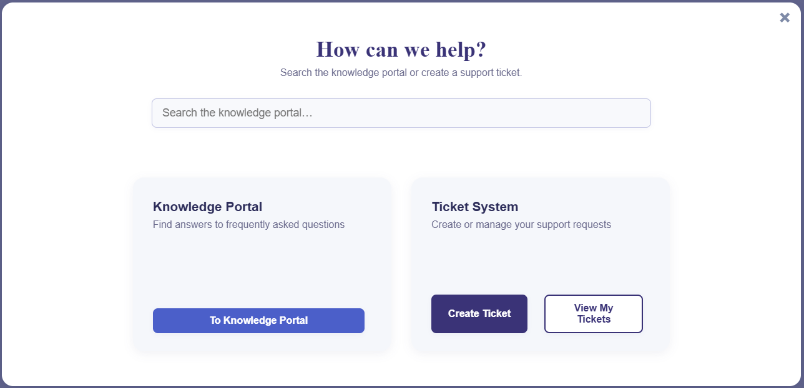
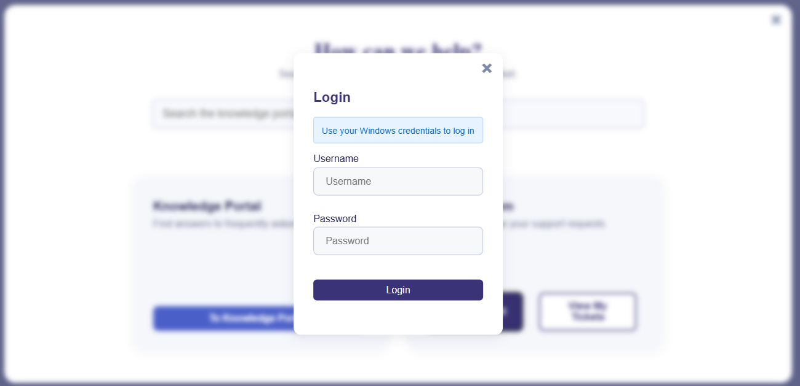
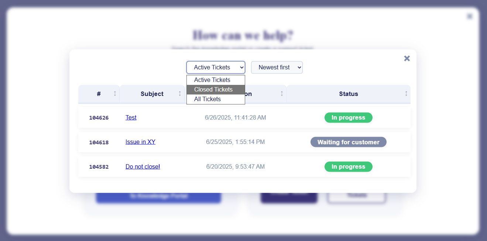
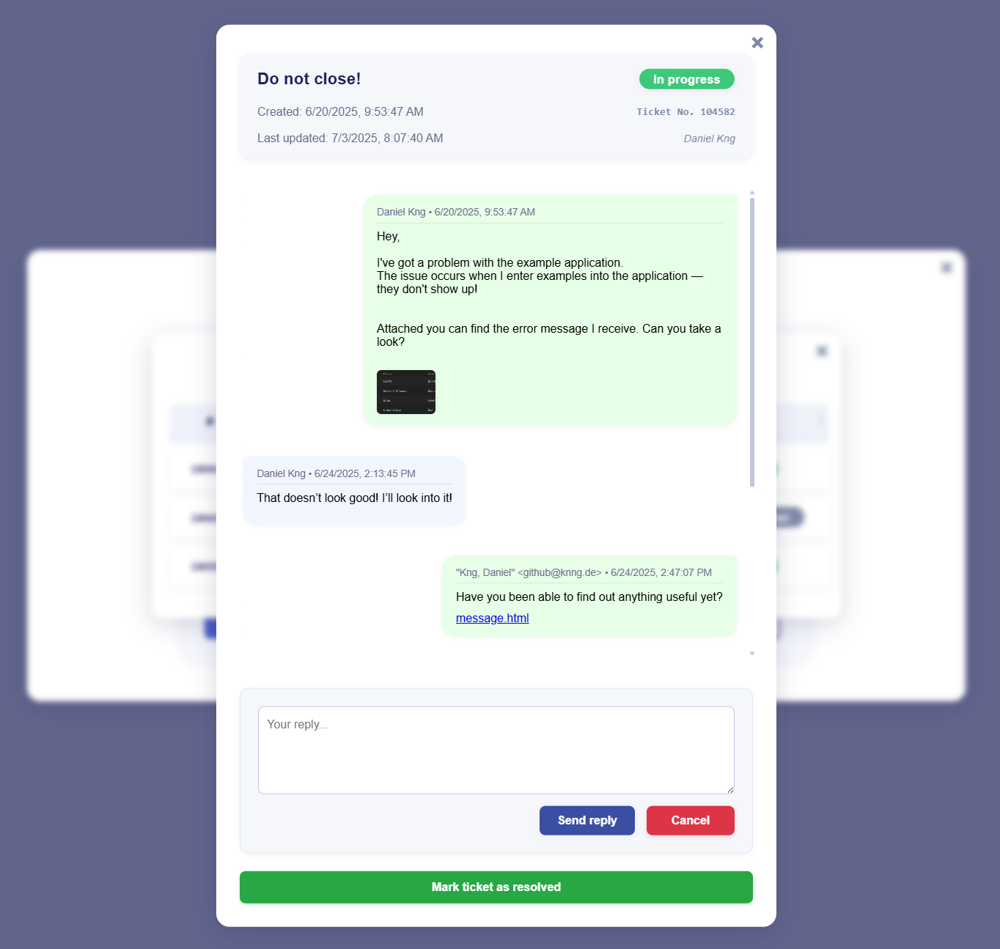
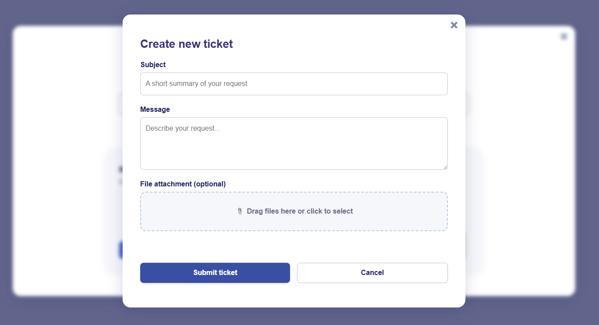

# Unofficial Zammad Ticket Portal


A modular, internationalized frontend for Zammad-based ticket systems that provides a modern user interface for creating and managing support tickets.

> **Note:** This is an unofficial community project, not affiliated with or endorsed by the Zammad Foundation.

---

## Screenshots

<table>
  <tr>
    <td></td>
    <td></td>
  </tr>
  <tr>
    <td></td>
    <td></td>
  </tr>
  <tr>
    <td></td>
    <td></td>
  </tr>
</table>

---

## Table of Contents

- [Overview](#overview)
- [Features](#features)
- [Installation](#installation)
- [Configuration](#configuration)
- [Zammad Setup](#zammad-setup)
- [Usage](#usage)
- [Technical Architecture](#technical-architecture)
- [Development](#development)
- [Troubleshooting](#troubleshooting)
- [Contributing](#contributing)
- [License](#license)

---

## Overview

This project provides a clean, modal-based interface for Zammad ticket systems that can be easily integrated into existing websites or intranets. It replaces the default Zammad interface with a more user-friendly experience while maintaining full functionality.

**Key Benefits:**
- Modern, responsive design that works on all devices
- Easy integration into existing websites via modal overlay
- Multi-language support (English/German, easily extensible)
- Smart caching for better performance
- File upload with drag-and-drop support
- Request type selection for ticket categorization

### Module Requirements

**This project uses ES6 modules and requires a web server** - it cannot be opened directly by double-clicking the HTML file.

> **Don't want npx or a webserver?** Check the [`legacy`](https://github.com/danielknng/zd-ticket-portal/tree/legacy) branch for a version that opens directly in browsers, locally. It's now deprecated, but has most of the functionality this `main`-Version has.

---

## Features

### User Features

- **Authentication** - Secure login via Zammad API with Basic Authentication
- **Ticket Management** - View all tickets (open and closed) with filtering and sorting
- **Ticket Creation** - Create new tickets with subject, message, and optional request type selection
- **File Attachments** - Upload files via drag-and-drop or file picker with preview functionality
- **Ticket Replies** - Reply to existing tickets with file attachments in messenger-style threads
- **Image Gallery** - View ticket attachments in a full-screen gallery
- **Knowledge Base** - Integrated search functionality for Zammad knowledge base
- **Self-Service** - Users can close their own tickets
- **Responsive Design** - Optimized for mobile and desktop devices

### Technical Features

- **ES Module Architecture** - Modern JavaScript with clean imports/exports
- **Centralized Configuration** - Single configuration file for all settings
- **Smart Caching System** - Context-aware caching with different TTL strategies
- **Multi-language Support** - JSON-based language files with dynamic loading
- **Event-Driven UI** - Proper initialization timing and error handling
- **Advanced Error Handling** - Retry mechanisms and user-friendly messages
- **Performance Monitoring** - Built-in measurement and optimization tools
- **Accessibility Support** - Keyboard navigation and screen reader compatibility

---

## Installation

### Prerequisites

- A web server (cannot run via `file://` protocol due to ES6 module restrictions)
- Zammad instance with Basic Authentication enabled
- Modern web browser with ES6 module support

### Local Development Setup

**Option 1: Using npx serve (Recommended)**

```powershell
# Navigate to the project root directory
cd "C:\path\to\zd-ticket-portal"

# Start a local web server
npx serve .

# Open http://localhost:3000/src/html/nf_gui.html in your browser
```

**Option 2: Deploy to Web Server**

Upload all files to your web server and access via HTTP/HTTPS. This is the recommended approach for production use.

### Integration with CMS Systems

**Contao CMS** (tested with the [`legacy`](https://github.com/DanielKng/zd-ticket-portal/tree/legacy) branch)

1. Upload all files to your server
2. Place the contents of `src/html/nf_gui.html` in a new Contao article
3. Adjust file paths to match your server structure
4. Remove `<meta charset="utf-8">` in `nf_gui.html` for Contao compatibility

**Other CMS Systems**

The portal works as a self-contained modal that can be embedded in any modern web environment. Simply include the HTML file and adjust the JavaScript paths accordingly.

---

## Configuration

All configuration is managed in `src/js/core/config.js`. This file controls:

- **API Endpoints** - Your Zammad server URLs and authentication
- **Language Settings** - Supported languages and file paths
- **Cache Strategy** - TTL values for optimal performance
- **Debug Options** - Logging for development and troubleshooting
- **Request Type Settings** - Enable/disable and filter request types
- **Security Settings** - File upload restrictions and validation

### Basic Configuration

```javascript
api: {
    baseUrl: 'https://helpdesk.yourdomain.de/api/v1',
    knowledgeBase: {
        id: "1",
        locale: "de-de",
        flavor: "public"
    },
    timeout: 10000,
    retryAttempts: 3,
    allowRequestType: true  // Enable request type selection
}
```

### Request Type Configuration

To enable request type selection in the ticket creation form:

1. **Enable the feature** in `src/js/core/config.js`:
   ```javascript
   api: {
       allowRequestType: true
   }
   ```

2. **Configure allowed types** (optional - empty array shows all types):
   ```javascript
   ui: {
       filters: {
           allowedRequestTypes: ["incident", "general_request", "order"]
           // Empty array [] = show all available types
       }
   }
   ```

3. **Set cache TTL** for request types:
   ```javascript
   ui: {
       cache: {
           requestTypeTTL: 24 * 60 * 60 * 1000  // 24 hours
       }
   }
   ```

See [Zammad Setup](#zammad-setup) for instructions on configuring the custom object in Zammad.

### Cache Configuration

Intelligent caching with content-aware TTL values:

```javascript
ui: {
    cache: {
        searchResultsTTL: 2 * 60 * 1000,                    // 2 minutes
        currentYearActiveTicketListTTL: 15 * 60 * 1000,     // 15 minutes
        currentYearClosedTicketListTTL: 4 * 60 * 60 * 1000, // 4 hours
        archivedTicketListTTL: 30 * 24 * 60 * 60 * 1000,    // 30 days
        requestTypeTTL: 24 * 60 * 60 * 1000                 // 24 hours
    }
}
```

**Cache Behavior:**
- Active tickets: Short TTL with manual refresh option
- Closed tickets: Medium TTL (may receive updates)
- Archived tickets: Long TTL (stable content)
- Search results: Brief TTL with cross-session persistence
- Request types: Long TTL (rarely change)

### Debug Configuration

Enable comprehensive logging for development:

```javascript
debug: {
    enabled: true,
    logLevel: 'debug'  // 'debug', 'info', 'warn', or 'error'
}
```

**Debug Output Includes:**
- Cache hit/miss ratios and TTL details
- API request/response timing
- Search result sources (cache vs. fresh API)
- Authentication status and errors
- Modal state changes and events

---

## Zammad Setup

### Basic Authentication

**Required:** Ensure Basic Authentication is enabled in your Zammad instance. This is typically configured in your Zammad system settings or via API configuration.

### Request Type Custom Object

To enable request type selection in the ticket creation form, you must configure a custom object attribute in Zammad:

1. **Log in to Zammad Admin Panel**

2. **Navigate to Object Manager**
   - Go to **Settings** > **Object Manager Attributes**
   - Or access directly via: `https://helpdesk.yourdomain.de/#system/object_manager`

3. **Create New Attribute**
   - Click **New Attribute**
   - Select **Ticket** as the object
   - Set the attribute name to: **`type`** (exactly, case-sensitive)
   - Choose **Single selection field** as the data type

4. **Configure Options**
   - Add your request type options (e.g., "General Request", "Incident", "Order")
   - Each option needs:
     - **Name**: Display label (e.g., "General Request")
     - **Value**: Database key (e.g., "general_request")
   - Set a default value if desired

5. **Example Configuration**
   ```
   Option 1:
   - Name: "General Request"
   - Value: "general_request"
   
   Option 2:
   - Name: "Incident"
   - Value: "problem"
   
   Option 3:
   - Name: "Order"
   - Value: "procurement"
   ```

6. **Verify API Access**
   - Test the API endpoint: `https://helpdesk.yourdomain.de/api/v1/object_manager_attributes?object=Ticket&name=type`
   - Should return the attribute configuration with all options

7. **Configure Frontend**
   - Set `allowRequestType: true` in `nf-config.js`
   - Optionally filter allowed types in `filters.allowedRequestTypes`
   - The dropdown will automatically populate with available options

**Important Notes:**
- The attribute name must be exactly `type` (lowercase)
- The attribute must be a "Single selection field" type
- Values in `allowedRequestTypes` must match the `value` field from the API, not the display name
- Changes to request types in Zammad will be reflected after cache expiration

### **Required:** Zammad's Reverse Proxy
Without this, your browser will likely not let you log in because we need to set the CORS header.
Add this block *directly above(!)* `location /ws {}`:

```bash
 # API-Server CORS (for Intranet-Portal)
 location ^~ /api/ {

  # remove upstream CORS Header
  proxy_hide_header Access-Control-Allow-Origin;
  proxy_hide_header Access-Control-Allow-Headers;
  proxy_hide_header Access-Control-Allow-Methods;
  proxy_hide_header Access-Control-Allow-Credentials;

  # only allow these origins
  set $cors_origin "";
  if ($http_origin = "http://localhost:3000") { set $cors_origin $http_origin; } # local testing (npx serve)
  if ($http_origin = "https://intranet.yourdomain.de") { set $cors_origin $http_origin; } # the domain where you've embedded the portal
  if ($http_origin = "https://helpdesk.yourdomain.de") { set $cors_origin $http_origin; } # URL of your zammad instance

  # CORS Header (also for 204)
  add_header Vary "Origin" always;
  add_header Access-Control-Allow-Origin $cors_origin always;
  add_header Access-Control-Allow-Methods "GET, POST, PUT, PATCH, DELETE, OPTIONS" always;
  add_header Access-Control-Allow-Headers "Authorization, Content-Type, Accept, Origin, X-Requested-With, X-CSRF-Token">
  add_header Access-Control-Max-Age "86400" always;

  # Preflight without Proxy
  if ($request_method = OPTIONS) {
    return 204;
  }

  proxy_http_version 1.1;
  proxy_set_header Host $http_host;
  proxy_set_header CLIENT_IP $remote_addr;
  proxy_set_header X-Forwarded-For $proxy_add_x_forwarded_for;
  proxy_set_header X-Forwarded-Proto $scheme;
  proxy_read_timeout 180;
  proxy_pass http://zammad-railsserver;
 }
 ```
Restart your nginx.
---

## Usage

### Basic Workflow

1. **Open the Portal** - Click the trigger button to open the modal interface
2. **Login** - Enter your Zammad credentials (username/email and password)
3. **View Tickets** - Browse your tickets with filtering and sorting options
4. **Create Ticket** - Click "Create Ticket" and fill in the form
   - Select request type (if enabled)
   - Enter subject and message
   - Attach files if needed
5. **Reply to Tickets** - Open a ticket and use the reply interface
6. **Close Tickets** - Mark tickets as resolved when complete

### Keyboard Navigation

- **ESC** - Close current modal or return to previous view
- **Tab** - Navigate between form fields
- **Enter** - Submit forms or activate buttons
- **Arrow Keys** - Navigate image gallery

### File Upload

- **Drag and Drop** - Drag files directly onto the upload area
- **Click to Select** - Click the upload area to open file picker
- **Preview** - View selected files before submission
- **Remove** - Click the X button to remove files from selection

---

## Technical Architecture

### Project Structure

```
zd-ticket-portal/
├── .github/
│   └── ISSUE_TEMPLATE/         # Bug report and feature request templates
├── public/
│   └── img/                    # Screenshots and assets
├── src/
│   ├── css/                    # Stylesheets
│   │   ├── base/              # Typography, variables, utilities
│   │   ├── components/         # Buttons, forms, modals
│   │   ├── layout/            # Cards, sections
│   │   └── modules/           # Feature-specific styles
│   ├── js/                     # JavaScript modules
│   │   ├── app.js             # Main application entry point
│   │   ├── core/              # Core system modules
│   │   │   ├── config.js      # Central configuration
│   │   │   ├── constants.js   # Global constants
│   │   │   ├── logger.js      # Logging system
│   │   │   └── storage.js     # localStorage utilities
│   │   ├── api/               # API layer
│   │   │   ├── client.js      # Zammad API client
│   │   │   ├── http.js        # HTTP utilities
│   │   │   ├── cache.js       # Caching system
│   │   │   ├── cache-strategy.js  # Cache TTL strategies
│   │   │   ├── auth.js        # Authentication service
│   │   │   ├── tickets.js    # Ticket service
│   │   │   └── knowledge-base.js  # Knowledge base service
│   │   ├── state/             # State management
│   │   │   ├── store.js      # Application state
│   │   │   └── events.js     # Event bus
│   │   ├── ui/                # UI layer
│   │   │   ├── dom.js        # DOM element references
│   │   │   ├── modal.js      # Modal management
│   │   │   ├── status.js     # Status messages
│   │   │   ├── helpers.js    # UI helper functions
│   │   │   ├── init.js       # UI initialization
│   │   │   └── modal-utils.js  # Modal utilities
│   │   ├── features/          # Feature modules
│   │   │   ├── tickets/      # Ticket features
│   │   │   │   ├── list.js   # Ticket list
│   │   │   │   ├── detail.js # Ticket detail view
│   │   │   │   ├── create.js # Ticket creation
│   │   │   │   └── actions.js  # Ticket actions (reply, close)
│   │   │   ├── search/       # Search features
│   │   │   │   └── knowledge-base.js  # Knowledge base search
│   │   │   ├── upload/       # File upload
│   │   │   │   └── file-handler.js  # File handling
│   │   │   └── gallery/      # Image gallery
│   │   │       └── viewer.js  # Gallery viewer
│   │   ├── utils/            # Utility modules
│   │   │   ├── validation.js  # Input validation
│   │   │   ├── error-boundary.js  # Error handling
│   │   │   ├── safe-access.js  # Safe global access
│   │   │   ├── loading.js     # Loading state wrapper
│   │   │   ├── errors.js     # Custom error classes
│   │   │   ├── file-processor.js  # File processing
│   │   │   ├── performance.js  # Performance monitoring
│   │   │   ├── visibility.js  # Visibility utilities
│   │   │   ├── focus.js      # Focus management
│   │   │   ├── template.js   # Template utilities
│   │   │   └── debounce.js   # Debounce utility
│   │   └── i18n/             # Internationalization
│   │       └── manager.js    # Language manager
│   ├── lang/                   # Language files
│   │   ├── en/                # English translations
│   │   └── de/                # German translations
│   └── html/
│       └── nf_gui.html        # Main interface
├── CONTRIBUTING.md             # Contribution guidelines
├── LICENSE.md                  # Project license
├── README.md                   # This file
└── SECURITY.md                 # Security policy
```

### Language Management

The language system uses JSON files organized by category:

```
src/lang/
├── en/
│   ├── ui.json         # Interface labels
│   ├── aria.json       # Accessibility text
│   ├── system.json     # Status messages
│   ├── messages.json   # User notifications
│   └── utils.json      # Utility text
└── de/
    └── (same structure)
```

Configuration in `src/js/core/config.js`:

```javascript
language: {
    default: 'en',
    current: 'en',
    basePath: '../lang',
    supported: {
        en: { locale: 'en-US', label: 'English' },
        de: { locale: 'de-DE', label: 'Deutsch' }
    },
    paths: {
        ui: '{lang}/ui.json',
        aria: '{lang}/aria.json',
        system: '{lang}/system.json',
        messages: '{lang}/messages.json',
        utils: '{lang}/utils.json'
    }
}
```

### Adding New Languages

1. Create new folder: `src/lang/[language-code]/`
2. Copy and translate all JSON files from an existing language
3. Add language configuration to `src/js/core/config.js`:
   ```javascript
   supported: {
       en: { locale: 'en-US', label: 'English' },
       de: { locale: 'de-DE', label: 'Deutsch' },
       fr: { locale: 'fr-FR', label: 'Français' }  // New language
   }
   ```
4. Update the current or default language setting if needed

**Language File Categories:**
- **ui.json** - Button labels, headers, form fields
- **aria.json** - Screen reader labels and descriptions
- **system.json** - Status messages, loading text
- **messages.json** - Success/error/warning messages
- **utils.json** - Date formats, validation messages

### Module System

The project uses ES6 modules with clear separation of concerns:

- **Core Modules** (`core/`) - Configuration, constants, logging, storage
- **API Layer** (`api/`) - HTTP client, authentication, ticket operations, caching
- **State Management** (`state/`) - Application state and event bus
- **UI Layer** (`ui/`) - DOM references, modals, status messages, helpers
- **Feature Modules** (`features/`) - Tickets, search, file upload, gallery
- **Utilities** (`utils/`) - Validation, error handling, performance, helpers
- **Internationalization** (`i18n/`) - Language management

All modules follow consistent ES6 import/export patterns with proper dependency injection and no backward compatibility prefixes.

---

## Development

### Development Setup

1. Clone the repository
2. Install a local web server (or use `npx serve`)
3. Configure `src/js/core/config.js` with your Zammad instance
4. Enable debug logging for development
5. Open `src/html/nf_gui.html` in your browser

### Code Style

- Use ES6 modules for all JavaScript
- Follow existing naming conventions (no backward compatibility prefixes)
- Use centralized utilities (`showStatus`, `logger`, etc.)
- Maintain language file organization
- Include appropriate debug logging
- Update documentation for new features

### Testing

Test with various scenarios:
- Different ticket states (open, closed, archived)
- Cache scenarios (fresh, cached, expired)
- File uploads (images, documents, email files)
- Error conditions (network failures, invalid credentials)
- Different languages and locales

---

## Troubleshooting

### Common Issues

**Module Loading Errors**
- **Symptom:** Console errors about module imports
- **Solution:** Ensure files are served from a web server (not `file://` protocol)
- **Alternative:** Use the `legacy` branch for direct file access

**Cache Not Working**
- **Symptom:** Data not persisting between sessions
- **Solution:** Check localStorage availability in browser settings
- **Check:** Verify TTL configuration in `src/js/core/config.js`

**Login Issues**
- **Symptom:** Authentication fails or hangs
- **Solution:** Verify Basic Authentication is enabled in Zammad
- **Check:** Confirm API URL is correct in configuration
- **Debug:** Enable debug logging to see detailed error messages

**Language Not Loading**
- **Symptom:** Interface shows translation keys instead of text
- **Solution:** Check file paths in `src/js/core/config.js`
- **Check:** Verify language files exist and are valid JSON
- **Debug:** Check browser network tab for failed requests

**Request Types Not Showing**
- **Symptom:** Dropdown is empty or hidden
- **Solution:** Verify `allowRequestType: true` in `src/js/core/config.js`
- **Check:** Confirm custom object is configured in Zammad (see [Zammad Setup](#zammad-setup))
- **Verify:** Test API endpoint returns attribute data
- **Debug:** Check browser console for API errors

**File Upload Fails**
- **Symptom:** Files not attaching to tickets
- **Solution:** Check file size limits in `src/js/core/config.js`
- **Check:** Verify allowed file types in security configuration
- **Debug:** Enable debug logging to see validation errors

### Getting Help

- **Check Issues:** Search existing [GitHub Issues](https://github.com/danielknng/zd-ticket-portal/issues)
- **Report Bugs:** Use the [Bug Report Template](.github/ISSUE_TEMPLATE/bug_report.md)
- **Request Features:** Use the [Feature Request Template](.github/ISSUE_TEMPLATE/feature_request.md)
- **Security Issues:** Follow the [Security Policy](SECURITY.md)

---

## Contributing

I welcome contributions from the community! This project follows GitHub best practices with comprehensive templates and guidelines.

### Getting Started

Please read the [Contributing Guidelines](CONTRIBUTING.md) for detailed information about:
- Development setup and prerequisites
- Code style and conventions
- Testing requirements
- Pull request process

### Reporting Issues

- **Bug Reports**: Use the [Bug Report Template](.github/ISSUE_TEMPLATE/bug_report.md)
- **Feature Requests**: Use the [Feature Request Template](.github/ISSUE_TEMPLATE/feature_request.md)

### Security

For security-related issues, please review the [Security Policy](SECURITY.md) and follow the responsible disclosure process outlined there.

### Development Guidelines

When contributing code:

1. Follow the established ES6 module patterns
2. Use the centralized `showStatus()` for user messaging
3. Maintain the language file organization
4. Include appropriate debug logging
5. Test with various ticket states and cache scenarios
6. Update documentation for new features
7. Use proper imports instead of global variables
8. Follow the new directory structure (core/, api/, features/, ui/, utils/, state/, i18n/)

---

## Development Timeline
**January 2026** - Bugfixes & Cleanup
- Fixed an issue with an import in `create.js`
- Fixed an issue where the serch bar returned an empty list of results
- Fixed an issue where `knowledge-base.js` would generate a wrong URL

**November 2025** - Request Types & Cleanup
- Added request type selection in ticket creation form
- Configurable filtering of available request types
- Integration with Zammad custom object attributes
- Removed all backward compatibility code and `nf` prefixes
- Renamed DOM object from `nf` to `dom` for clarity
- Reorganized codebase into logical directories (core/, api/, features/, ui/, utils/, state/, i18n/)
- Implemented proper dependency injection pattern
- Created service layer for API operations (AuthService, TicketService, KnowledgeBaseService)
- Centralized error handling and validation
- Improved code maintainability and separation of concerns
- Zero build step deployment with ES6 modules

**July 15, 2025** - Attachment System & Polish
- Complete attachment implementation with "Attach files..." button for ticket replies
- Centralized file module (`nf-file-upload.js`) with comprehensive validation, Base64 conversion, and drag-drop
- Email file support for .eml, .msg, .mbox files
- Standardized 44px button height for consistent visual appearance
- Fixed login error handling that caused infinite loader
- Moved all hardcoded strings to proper language files
- Enhanced file preview functionality

**July 14, 2025** - Modern Language System
- Complete migration to JSON-based language management
- Separated language files by category for better maintainability
- Event-driven initialization with proper timing synchronization
- Configurable language paths
- Improved date localization with consistent locale-based formatting
- Enhanced event system with consolidated keyboard accessibility handling
- Finished ES Module Architecture

**July 9, 2025** - ES Module Migration
- Refactored JavaScript to use modern imports/exports
- Centralized modal system for unified popup interactions
- Enhanced UX design with improved modal effects
- Updated for modern browser requirements

**July 2025** - Cache & Status System Overhaul
- Intelligent cache architecture with context-aware caching
- Cross-session persistence for search results and ticket details
- Smart cache invalidation with manual reload
- Centralized status system for unified message handling
- Enhanced login experience with credential hints
- Configurable TTL values with descriptive naming

**Early July 2025** - Foundation & Core Features
- Zammad API integration with complete ticket lifecycle management
- Multi-language support (German and English) with extensible framework
- Responsive modal design with background blur and layered modals
- File upload system with drag-and-drop and preview
- Gallery integration for viewing ticket attachments
- Knowledge base search integration
- Accessibility features with keyboard navigation and screen reader support

---

## License

This project is licensed under the Creative Commons Attribution-NonCommercial-ShareAlike 4.0 International License.

See [LICENSE.md](LICENSE.md) for full details or visit: https://creativecommons.org/licenses/by-nc-sa/4.0/legalcode
